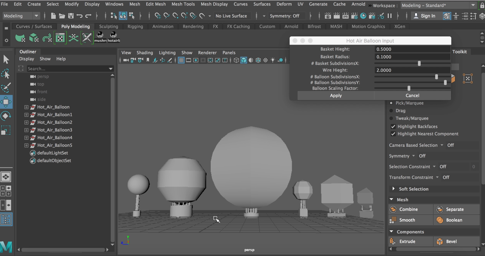

# 🎈Hot Air Balloon Generator 

This is a tool made with Maya Python scripting to generate low-poly hot air balloons. The user can adjust parameters of their hot air balloon including: basket height, basket radius, number of basket subdivisions in X, wire height, number of balloon subdivisions in X and Y, and scaling of the balloon.

[My tool in action!](https://www.youtube.com/watch?v=4QRtdWbHPH0)

